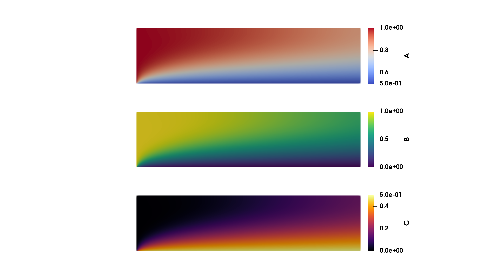

=======================================================================
Demo: Steady Multiphysics Simulation (Coupled Diffusion Reaction)
=======================================================================

This demo code demonstrate how to solve a steady coupled Advection-Diffusion-Reaction problem with surface reaction terms at the boundary. 
This demo is used to demonstrate how to use the `MultiphysicsProblem` class in FLATiron.

The source code can be found in **demo/demo_steady_multiphysics/demo_steady_multiphysics.py**.

Problem definition
--------------------

First we define the concentration of chemical species :math:`A`, :math:`B`, and :math:`C`, for a 1D domain of length :math:`L`, we have

.. math::

    D_A \frac{d^2A}{dx^2} - k_v A B = 0

.. math::

    D_B \frac{d^2B}{dx^2} - 2k_v A B = 0

.. math::

    D_C \frac{d^2C}{dx^2} + k_v A B = 0

The left boundary conditions are as follows

.. math::

    A(x=0) = C_0 \\
    B(x=0) = C_0 \\
    C(x=0) = 0 \\

And the surface reactions on the right boundary

.. math::

    \frac{dA}{dx}(x=L) = - \frac{k_s}{D_A} A B \\
    \frac{dB}{dx}(x=L) = - \frac{2k_s}{D_B} A B \\
    \frac{dC}{dx}(x=L) = \frac{k_s}{D_C} A B \\

Implementation
----------------

Fist, we import code the relevant modules from flatiron_tk and the basic libraries and define the mesh and constants.

.. code-block:: python

    import dolfinx
    import ufl

    from flatiron_tk.mesh import RectMesh
    from flatiron_tk.physics import MultiphysicsProblem
    from flatiron_tk.physics import SteadyScalarTransport
    from flatiron_tk.solver import NonLinearProblem
    from flatiron_tk.solver import NonLinearSolver

    '''
    Demo for a coupled diffusion reaction problem
    D_A \\frac{d^2A}{dx^2} - k_v A B = 0 
    D_B \\frac{d^2B}{dx^2} - 2k_v A B = 0
    D_C \\frac{d^2C}{dx^2} + k_v A B = 0

    BC: 
    A(x=0) = C0
    B(x=0) = C0
    C(x=0) = 0

    \\nabla A \\cdot \\hat{n} = -k_S A B  / D_A \\forall \\vec{x} \\in \\Gamma_B
    \\nabla B \\cdot \\hat{n} = -2K_S A B / D_B \\forall \\vec{x} \\in \\Gamma_B
    \\nabla C \\cdot \\hat{n} = K_s A B   / D_C \\forall \\vec{x} \\in \\Gamma_B
    '''

    # Create Mesh
    mesh = RectMesh(0.0, 0.0, 4.0, 1.0, 1/64)

    # Define Constants
    D_A = 0.1; D_B = 0.1; D_C = 0.1
    k_v = dolfinx.fem.Constant(mesh.msh, dolfinx.default_scalar_type(0.01))
    k_s = 1
    c0 = 1
    u_mag = 10.0

    # Create the velocity field 
    U = u_mag
    x = ufl.SpatialCoordinate(mesh.msh)
    u = ufl.as_vector([U * x[1] * (1 - x[1]), 0.0])

Next we define ``SteadyScalarTransport`` problems for all three species and set the appropriate tag to disambiguate them.

.. code-block:: python

    # Define Physics A, B, C
    stp_A = SteadyScalarTransport(mesh, tag='A', q_degree=5)
    stp_A.set_element('CG', 1)
    stp_A.set_advection_velocity(u)
    stp_A.set_diffusivity(D_A)

    stp_B = SteadyScalarTransport(mesh, tag='B', q_degree=5)
    stp_B.set_element('CG', 1)
    stp_B.set_advection_velocity(u)
    stp_B.set_diffusivity(D_B)

    stp_C = SteadyScalarTransport(mesh, tag='C', q_degree=5)
    stp_C.set_element('CG', 1)
    stp_C.set_advection_velocity(u)
    stp_C.set_diffusivity(D_C)

Now we build a ``MultiPhysicsProblem`` as a collection of the three ``ScalarTransport`` physics that we created.

.. code-block:: python 

    # Build Multiphysics Problem
    coupled_physics = MultiphysicsProblem(stp_A, stp_B, stp_C)
    coupled_physics.set_element()
    coupled_physics.build_function_space()

Now, we will set the terms which couple the three equations together. This is done by first grabbing the solution 
function of from each species through the ``get_solution_function()`` method by supplying the appropriate tag for each species. 
Then we set reaction associated with each species' equation through the ``set_reaction()`` function on the 
individual ``SteadyScalarTransport`` object. Finally, we finalize the volumetric weak formulation. We additionally add 
SUPG stabilization to each equation.

.. code-block:: python 

    A = coupled_physics.get_solution_function('A')
    B = coupled_physics.get_solution_function('B')
    C = coupled_physics.get_solution_function('C')

    stp_A.set_reaction(-k_v * A * B)
    stp_B.set_reaction(-2 * k_v * A * B)
    stp_C.set_reaction(k_v * A * B)

    # Set weak form and stabilization
    stp_options = {'stab':True}
    coupled_physics.set_weak_form(stp_options,stp_options,stp_options)

Now we set the boundary conditions dictionary for each physics and create an overall dictionary with the species tag 
called ``bc_dict`` which we supply into the ``coupled_physics`` object. The format for the individual boundary condition dictionary
has the same format as a single species transport problem. Here, we utilize the solution functions that we
grabbed earlier to define the Neumann boundary condition. We can do this because Neumann boundary condition is 
simply an additional term in the weak formulation.

.. code-block:: python 

    # 5 = left, 
    # 8 = bottom 
    n = mesh.get_facet_normal()
    A_bcs = {
        1: {'type': 'dirichlet', 'value': dolfinx.fem.Constant(mesh.msh, dolfinx.default_scalar_type(c0))},
        2: {'type': 'neumann', 'value': -k_s*A*B/D_A * n}
    }
    B_bcs = {
        1: {'type': 'dirichlet', 'value': dolfinx.fem.Constant(mesh.msh, dolfinx.default_scalar_type(c0))},
        2: {'type': 'neumann', 'value': -2*k_s*A*B/D_B * n}
    }
    C_bcs = {
        1: {'type': 'dirichlet', 'value': dolfinx.fem.Constant(mesh.msh, dolfinx.default_scalar_type(0.0))},
        2: {'type': 'neumann', 'value': k_s*A*B/D_C * n}
    }

    bc_dict = {
        'A': A_bcs,
        'B': B_bcs,
        'C': C_bcs
    }

    coupled_physics.set_bcs(bc_dict)

Finally, we create a nonlinear problem and solver to solve the coupled system.

.. code-block:: python

    # Set writers
    coupled_physics.set_writer('output', 'pvd')

    # Set problem
    problem = NonLinearProblem(coupled_physics)
    solver = NonLinearSolver(mesh.msh.comm, problem)

    # Solve and write
    solver.solve()
    coupled_physics.write()

This code should give the following result:

Full Script
----------------

.. code-block:: python

    import dolfinx
    import ufl

    from flatiron_tk.mesh import RectMesh
    from flatiron_tk.physics import MultiphysicsProblem
    from flatiron_tk.physics import SteadyScalarTransport
    from flatiron_tk.solver import NonLinearProblem
    from flatiron_tk.solver import NonLinearSolver

    '''
    Demo for a coupled diffusion reaction problem
    D_A \\frac{d^2A}{dx^2} - k_v A B = 0 
    D_B \\frac{d^2B}{dx^2} - 2k_v A B = 0
    D_C \\frac{d^2C}{dx^2} + k_v A B = 0

    BC: 
    A(x=0) = C0
    B(x=0) = C0
    C(x=0) = 0

    \\nabla A \\cdot \\hat{n} = -k_S A B  / D_A \\forall \\vec{x} \\in \\Gamma_B
    \\nabla B \\cdot \\hat{n} = -2K_S A B / D_B \\forall \\vec{x} \\in \\Gamma_B
    \\nabla C \\cdot \\hat{n} = K_s A B   / D_C \\forall \\vec{x} \\in \\Gamma_B
    '''

    # Create Mesh
    mesh = RectMesh(0.0, 0.0, 4.0, 1.0, 1/64)

    # Define Constants
    D_A = 0.1; D_B = 0.1; D_C = 0.1
    k_v = dolfinx.fem.Constant(mesh.msh, dolfinx.default_scalar_type(0.01))
    k_s = 1
    c0 = 1
    u_mag = 10.0

    # Create the velocity field 
    U = u_mag
    x = ufl.SpatialCoordinate(mesh.msh)
    u = ufl.as_vector([U * x[1] * (1 - x[1]), 0.0])

    # Define Physics A, B, C
    stp_A = SteadyScalarTransport(mesh, tag='A', q_degree=5)
    stp_A.set_element('CG', 1)
    stp_A.set_advection_velocity(u)
    stp_A.set_diffusivity(D_A)

    stp_B = SteadyScalarTransport(mesh, tag='B', q_degree=5)
    stp_B.set_element('CG', 1)
    stp_B.set_advection_velocity(u)
    stp_B.set_diffusivity(D_B)

    stp_C = SteadyScalarTransport(mesh, tag='C', q_degree=5)
    stp_C.set_element('CG', 1)
    stp_C.set_advection_velocity(u)
    stp_C.set_diffusivity(D_C)

    # Build Multiphysics Problem
    coupled_physics = MultiphysicsProblem(stp_A, stp_B, stp_C)
    coupled_physics.set_element()
    coupled_physics.build_function_space()

    A = coupled_physics.get_solution_function('A')
    B = coupled_physics.get_solution_function('B')
    C = coupled_physics.get_solution_function('C')

    stp_A.set_reaction(-k_v * A * B)
    stp_B.set_reaction(-2 * k_v * A * B)
    stp_C.set_reaction(k_v * A * B)

    # Set weak form and stabilization
    stp_options = {'stab':True}
    coupled_physics.set_weak_form(stp_options,stp_options,stp_options)

    # 5 = left, 
    # 8 = bottom 
    n = mesh.get_facet_normal()
    A_bcs = {
        1: {'type': 'dirichlet', 'value': dolfinx.fem.Constant(mesh.msh, dolfinx.default_scalar_type(c0))},
        2: {'type': 'neumann', 'value': -k_s*A*B/D_A * n}
    }
    B_bcs = {
        1: {'type': 'dirichlet', 'value': dolfinx.fem.Constant(mesh.msh, dolfinx.default_scalar_type(c0))},
        2: {'type': 'neumann', 'value': -2*k_s*A*B/D_B * n}
    }
    C_bcs = {
        1: {'type': 'dirichlet', 'value': dolfinx.fem.Constant(mesh.msh, dolfinx.default_scalar_type(0.0))},
        2: {'type': 'neumann', 'value': k_s*A*B/D_C * n}
    }

    bc_dict = {
        'A': A_bcs,
        'B': B_bcs,
        'C': C_bcs
    }

    coupled_physics.set_bcs(bc_dict)
        
    # Set writers
    coupled_physics.set_writer('output', 'pvd')

    # Set problem
    problem = NonLinearProblem(coupled_physics)
    solver = NonLinearSolver(mesh.msh.comm, problem)

    # Solve and write
    solver.solve()
    coupled_physics.write()

