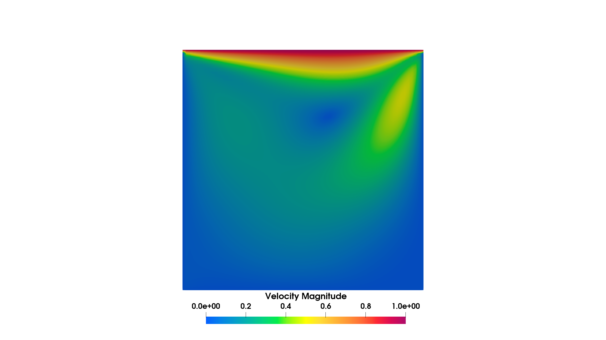

=========================================================
Demo: Steady Navier-Stokes
=========================================================

This demo code demonstrates how to solve a steady state incompressible Navier-Stokes equation using the canonical lid driven cavity problem.
The full source code can be found in **demo/demo_steady_navier_stokes/demo_steady_navier_stokes.py**.

This problem is the steady state incompressible Navier-Stokes problem in a unit square domain.

Strong form

.. math::

    \rho \textbf{u} \cdot \nabla \textbf{u} = \boldsymbol{\sigma} + \textbf{b} \\

    \nabla \cdot \textbf{u} = 0

Where the stress term is

.. math::

    \boldsymbol{\sigma} = -p\textbf{I} + \mu\left(\nabla \textbf{u} + \nabla \textbf{u}^T \right)

The boundary conditions are

.. math::

    \textbf{u}(x=0) = \textbf{u}(x=1) = \textbf{u}(y=0) = \textbf{0} \\

    \textbf{u}(y=1) = (1, 0) \\

    p(x=0,y=0) = 0

Implementation
-----------------

First we import the relevant modules and define functions representing the boundary conditions.

.. code-block:: python
    import dolfinx
    import numpy as np

    from flatiron_tk.mesh import RectMesh
    from flatiron_tk.physics import SteadyNavierStokes
    from flatiron_tk.solver  import ConvergenceMonitor
    from flatiron_tk.solver import NonLinearProblem
    from flatiron_tk.solver import NonLinearSolver

    # Define boundary conditions functions
    def no_slip(x):
        return np.stack((np.zeros(x.shape[1]), np.zeros(x.shape[1])))

    def u_inlet(x):
        return np.stack((np.ones(x.shape[1]), np.zeros(x.shape[1])))

    def zero_pressure(x):
        return np.zeros(x.shape[1], dtype=dolfinx.default_scalar_type)

Next, we define the mesh. 

.. code-block:: python 
        
    # Create mesh
    ne = 64
    mesh = RectMesh(0.0, 0.0, 1.0, 1.0, 1/ne)

Next, we define the incompressible Navier Stokes solver using the ``SteadyNavierStokes`` physics. 
Here we will use the *unstable* elements combination Q1P1 and we will add stabilization.

.. code-block:: python

    # Build Navier-Stokes problem
    nse = SteadyNavierStokes(mesh)
    nse.set_element('CG', 1, 'CG', 1)
    nse.build_function_space()

Next the problem parameters are defined and the weak formulation is set. We call ``add_stab()`` to add the stabilization terms. 
In this implementation, we include both the SUPG and PSPG stabilization. 
Please see :doc:`Steady Navier Stokes Physics <../_modules/physics_modules/module_navier-stokes>` for more detail.

.. code-block:: python

    # Set physical parameters
    Re = 100.0
    mu = 1.0 / Re
    rho = 1.0
    nse.set_density(rho)
    nse.set_dynamic_viscosity(mu)

    # Set weak form and stabilization
    nse.set_weak_form()
    nse.add_stab()

Next, we define the boundary conditions. We use the previously defined functions to set the velocity on the walls and lid,
and we set a zero pressure point constraint at the bottom left corner of the domain. The boundary conditions
are defined above as arrays and passed onto dolfinx Function objects built off the sub spaces of the mixed function space.

.. code-block:: python

    # Create boundary condition functions
    zero_v = dolfinx.fem.Function(V_u)
    zero_v.interpolate(no_slip)
    inlet_v = dolfinx.fem.Function(V_u)
    inlet_v.interpolate(u_inlet)
    zero_p = dolfinx.fem.Function(V_p)
    zero_p.x.array[:] = 0.0

    # Define boundary conditions
    u_bcs = {
            1: {'type': 'dirichlet', 'value': zero_v},
            2: {'type': 'dirichlet', 'value': zero_v},
            3: {'type': 'dirichlet', 'value': zero_v},
            4: {'type': 'dirichlet', 'value': inlet_v},
            }

    p_bcs = {
            1: {'type': 'dirichlet', 'value': zero_p},
            }

    bc_dict = {'u': u_bcs, 
            'p': p_bcs}

    nse.set_bcs(bc_dict)

Next, we define the nonlinear problem and solver. We use a Krylov solver and adjust 
the solver parameter using a function that sets the PETSc KSP options.

.. code-block:: python

    # Define problem
    problem = NonLinearProblem(nse)

    # Custom KSP setup function
    def my_custom_ksp_setup(ksp):
        ksp.setType(ksp.Type.FGMRES)        
        ksp.pc.setType(ksp.pc.Type.LU)  
        ksp.setTolerances(rtol=1e-8, atol=1e-10, max_it=500)
        ksp.setMonitor(ConvergenceMonitor('ksp'))

    # Create nonlinear solver
    solver = NonLinearSolver(mesh.msh.comm, problem, outer_ksp_set_function=my_custom_ksp_setup)

Finally, we solve the problem and write the results.

.. code-block:: python

    # Solve the problem
    solver.solve()
    nse.write()

The solution is shown below.

Full Script
-----------------

.. code-block:: python
    
    import dolfinx
    import numpy as np

    from flatiron_tk.mesh import RectMesh
    from flatiron_tk.physics import SteadyNavierStokes
    from flatiron_tk.solver  import ConvergenceMonitor
    from flatiron_tk.solver import NonLinearProblem
    from flatiron_tk.solver import NonLinearSolver

    # Define boundary conditions functions
    def no_slip(x):
        return np.stack((np.zeros(x.shape[1]), np.zeros(x.shape[1])))

    def u_inlet(x):
        return np.stack((np.ones(x.shape[1]), np.zeros(x.shape[1])))

    def zero_pressure(x):
        return np.zeros(x.shape[1], dtype=dolfinx.default_scalar_type)

    # Create mesh
    ne = 64
    mesh = RectMesh(0.0, 0.0, 1.0, 1.0, 1/ne)

    # Build Navier-Stokes problem
    nse = SteadyNavierStokes(mesh)
    nse.set_element('CG', 1, 'CG', 1)
    nse.build_function_space()

    # Set physical parameters
    Re = 100.0
    mu = 1.0 / Re
    rho = 1.0
    nse.set_density(rho)
    nse.set_dynamic_viscosity(mu)

    # Set weak form and stabilization
    nse.set_weak_form()
    nse.add_stab()

    # Velocity and pressure subspaces
    V_u = nse.get_function_space('u').collapse()[0]
    V_p = nse.get_function_space('p').collapse()[0]

    # Create boundary condition functions
    zero_v = dolfinx.fem.Function(V_u)
    zero_v.interpolate(no_slip)
    inlet_v = dolfinx.fem.Function(V_u)
    inlet_v.interpolate(u_inlet)
    zero_p = dolfinx.fem.Function(V_p)
    zero_p.x.array[:] = 0.0

    # Define boundary conditions
    u_bcs = {
            1: {'type': 'dirichlet', 'value': zero_v},
            2: {'type': 'dirichlet', 'value': zero_v},
            3: {'type': 'dirichlet', 'value': zero_v},
            4: {'type': 'dirichlet', 'value': inlet_v},
            }

    p_bcs = {
            1: {'type': 'dirichlet', 'value': zero_p},
            }

    bc_dict = {'u': u_bcs, 
            'p': p_bcs}

    nse.set_bcs(bc_dict)

    nse.set_writer('output', 'pvd')

    # Define problem
    problem = NonLinearProblem(nse)

    # Custom KSP setup function
    def my_custom_ksp_setup(ksp):
        ksp.setType(ksp.Type.FGMRES)        
        ksp.pc.setType(ksp.pc.Type.LU)  
        ksp.setTolerances(rtol=1e-8, atol=1e-10, max_it=500)
        ksp.setMonitor(ConvergenceMonitor('ksp'))

    # Create nonlinear solver
    solver = NonLinearSolver(mesh.msh.comm, problem, outer_ksp_set_function=my_custom_ksp_setup)

    # Solve the problem
    solver.solve()
    nse.write()