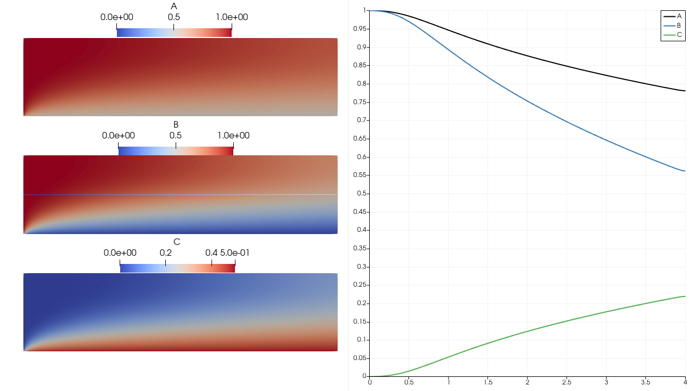

Demo 2 species reaction in 2_species_reaction_2D
======================================================

This demo code demonstrates how to solve a steady coupled Advection-Diffusion-Reaction problem with surface reaction terms at the boundary. 

.. math::

    \text{Strong Form:} \\
    
.. math::
    
    \frac{Dc_i}{Dt} = D_i \nabla^2 + R_i \forall i \in \text{Num Species} \\
    
.. math::

    R_A = - k_v A B = 0 \\
    R_B = - 2k_v A B = 0 \\
    R_C = + k_v A B = 0 \\
    
where

.. math::
   
   D_i 

are the diffusivities of each species and

.. math::
    
    k_v \text{ and } k_s 
    
are volumetric and surface reaction rates, respectively.

The domain is rectangular with x in [0, 4] and y in [0, 1]. 
    
.. math::

    \text{BC:} \\

.. math::

    A(\vec{x}) = C0 \forall \vec{x} \in \Gamma_L \\
    B(\vec{x}) = C0 \forall \vec{x} \in \Gamma_L \\
    C(\vec{x}) = 0 \forall \vec{x} \in \Gamma_L \\

.. math::

    \nabla A \cdot \hat{n} = -k_S A B  / D_A \forall \vec{x} \in \Gamma_B \\ 
    \nabla B \cdot \hat{n} = -2K_S A B / D_B \forall \vec{x} \in \Gamma_B \\
    \nabla C \cdot \hat{n} = K_s A B   / D_C \forall \vec{x} \in \Gamma_B \\

The velocity field is given as the parabolic profile defined by:

.. math::

    u = (U*y*(1-xy), 0) \\ 

First, we import the relevant modules from FLATIron_tk.

.. code:: python

    import fenics as fe
    from flatiron_tk.physics import MultiPhysicsProblem, ScalarTransport
    from flatiron_tk.mesh import Mesh
    from flatiron_tk.mesh.basic_mesh import RectMesh
    from flatiron_tk.solver import PhysicsSolver

Next, we define the mesh and constants.

.. code:: python 

    # Define mesh
    dx = 0.02
    mesh = RectMesh(0, 0, 4, 1, dx)

    # Mark mesh
    def left(x, left_bnd):
        return abs(x[0] - left_bnd) < fe.DOLFIN_EPS
    def right(x, right_bnd):
        return abs(right_bnd - x[0]) < fe.DOLFIN_EPS
    def top(x, top_bnd):
        return abs(top_bnd - x[1]) < fe.DOLFIN_EPS
    def bottom(x, bottom_bnd):
        return abs(x[1] - bottom_bnd) < fe.DOLFIN_EPS

    mesh.mark_boundary(1, left, (0.))
    mesh.mark_boundary(2, bottom, (0.))
    mesh.mark_boundary(3, right, (1.))
    mesh.mark_boundary(4, top, (1.))

    # Define constants
    D_A = 0.1; D_B = 0.1; D_C = 0.1 # diffusion coefficients
    k_v = fe.Constant(0) # Volumetric reaction rate
    k_s = 1 # Surface reaction rate
    C0 = 1 # Left BC for species A and B
    u_mag = 10.0

    # Parabolic inlet profile
    u = fe.Expression(('U*x[1]*(1-x[1])','0'), U=u_mag, degree=2)

Now, we define ``ScalarTransport`` problems for species A, B, and C.

.. code:: python

    # Define the problem for species A
    A_pde = ScalarTransport(mesh, tag='A')
    A_pde.set_element('CG', 1)
    A_pde.set_advection_velocity(u)
    A_pde.set_diffusivity(D_A)

    # Define the problem for species B
    B_pde = ScalarTransport(mesh, tag='B')
    B_pde.set_element('CG', 1)
    B_pde.set_advection_velocity(u)
    B_pde.set_diffusivity(D_B)

    # Define the problem for species C
    C_pde = ScalarTransport(mesh, tag='C')
    C_pde.set_element('CG', 1)
    C_pde.set_advection_velocity(u)
    C_pde.set_diffusivity(D_C)

Next, we set a ``MultiphysicsProblem`` using the three ``ScalarTransport`` objects we just defined.

.. code:: python 

    coupled_physics = MultiPhysicsProblem(A_pde, B_pde, C_pde)
    coupled_physics.set_element()
    coupled_physics.build_function_space()

Set the coupling part of the equations here, we can see the coupling as the reaction terms we use the solution_function instead of trial function because this will be a nonlinear problem, and we will solve the problem using Newton iteration by taking the Gateaux derivative of the weak form W.R.T the solution functions. Finally, we set the weak formulation of the coupled physics by setting the linearity to ``False``.

.. code:: python 

    A = coupled_physics.solution_function('A')
    B = coupled_physics.solution_function('B')
    C = coupled_physics.solution_function('C')
    A_pde.set_reaction(-k_v*A*B)
    B_pde.set_reaction(-2*k_v*A*B)
    C_pde.set_reaction(k_v*A*B)

    coupled_physics.set_weak_form()

Now, we set the boundaty conditions for each species.

.. code:: python

    # Set BCs for specific physics
    n = mesh.facet_normal()
    A_bcs = {
            1: {'type': 'dirichlet', 'value': fe.Constant(C0)},
            2: {'type': 'neumann', 'value': -k_s*A*B/D_A * n}
            }

    B_bcs = {
            1: {'type': 'dirichlet', 'value': fe.Constant(C0)},
            2: {'type': 'neumann', 'value': -2*k_s*A*B/D_B * n}
            }

    C_bcs = {
            1: {'type': 'dirichlet', 'value': fe.Constant(0)},
            2: {'type': 'neumann', 'value': k_s*A*B/D_C * n}
            }

    bc_dict = {
            'A': A_bcs,
            'B': B_bcs,
            'C': C_bcs
            }

    coupled_physics.set_bcs(bc_dict)

Finally, we solve with the nonlinear problem and solver and save the result.

.. code:: python

    # Solve this problem using a nonlinear solver
    la_solver = fe.LUSolver()
    solver = PhysicsSolver(coupled_physics, la_solver)
    solver.solve()

    # Write solution
    coupled_physics.set_writer('output', 'pvd')
    coupled_physics.write()

The code should give the following result:

** Here is the full script:**

.. code:: python

    import numpy as np
    import matplotlib.pyplot as plt
    import sys
    import time
    import copy
    import os

    # ------------------------------------------------------- #

    '''
    Demo for a coupled diffusion reaction problem
    D_A \\frac{d^2A}{dx^2} - k_v A B = 0 
    D_B \\frac{d^2B}{dx^2} - 2k_v A B = 0
    D_C \\frac{d^2C}{dx^2} + k_v A B = 0

    BC: 
    A(x=0) = C0
    B(x=0) = C0
    C(x=0) = 0

    \\nabla A \\cdot \\hat{n} = -k_S A B  / D_A \\forall \\vec{x} \\in \\Gamma_B
    \\nabla B \\cdot \\hat{n} = -2K_S A B / D_B \\forall \\vec{x} \\in \\Gamma_B
    \\nabla C \\cdot \\hat{n} = K_s A B   / D_C \\forall \\vec{x} \\in \\Gamma_B
    '''

    # ---------------------------------------------------------- #

    import fenics as fe
    from flatiron_tk.physics import MultiPhysicsProblem, ScalarTransport
    from flatiron_tk.mesh import Mesh
    from flatiron_tk.mesh.basic_mesh import RectMesh
    from flatiron_tk.solver import PhysicsSolver

    # Define mesh
    dx = 0.02
    mesh = RectMesh(0, 0, 4, 1, dx)

    # Mark mesh
    def left(x, left_bnd):
        return abs(x[0] - left_bnd) < fe.DOLFIN_EPS
    def right(x, right_bnd):
        return abs(right_bnd - x[0]) < fe.DOLFIN_EPS
    def top(x, top_bnd):
        return abs(top_bnd - x[1]) < fe.DOLFIN_EPS
    def bottom(x, bottom_bnd):
        return abs(x[1] - bottom_bnd) < fe.DOLFIN_EPS

    mesh.mark_boundary(1, left, (0.))
    mesh.mark_boundary(2, bottom, (0.))
    mesh.mark_boundary(3, right, (1.))
    mesh.mark_boundary(4, top, (1.))

    # Define constants
    D_A = 0.1; D_B = 0.1; D_C = 0.1 # diffusion coefficients
    k_v = fe.Constant(0) # Volumetric reaction rate
    k_s = 1 # Surface reaction rate
    C0 = 1 # Left BC for species A and B
    u_mag = 10.0

    # Parabolic inlet profile
    u = fe.Expression(('U*x[1]*(1-x[1])','0'), U=u_mag, degree=2)

    # Define the problem for species A
    A_pde = ScalarTransport(mesh, tag='A')
    A_pde.set_element('CG', 1)
    A_pde.set_advection_velocity(u)
    A_pde.set_diffusivity(D_A)

    # Define the problem for species B
    B_pde = ScalarTransport(mesh, tag='B')
    B_pde.set_element('CG', 1)
    B_pde.set_advection_velocity(u)
    B_pde.set_diffusivity(D_B)

    # Define the problem for species C
    C_pde = ScalarTransport(mesh, tag='C')
    C_pde.set_element('CG', 1)
    C_pde.set_advection_velocity(u)
    C_pde.set_diffusivity(D_C)

    # Define a multiphysics problem as a combination of physics of
    # species A, B, C 
    coupled_physics = MultiPhysicsProblem(A_pde, B_pde, C_pde)
    coupled_physics.set_element()
    coupled_physics.build_function_space()

    # Set the coupling part of the equations
    # here, we can see the coupling as the reaction terms
    # we use the solution_function instead of trial function because this will be a
    # nonlinear problem, and we will solve the problem using Newton iteration by taking
    # the Gateaux derivative of the weak form W.R.T the solution functions
    A = coupled_physics.solution_function('A')
    B = coupled_physics.solution_function('B')
    C = coupled_physics.solution_function('C')
    A_pde.set_reaction(-k_v*A*B)
    B_pde.set_reaction(-2*k_v*A*B)
    C_pde.set_reaction(k_v*A*B)

    # Set weakform. Make sure that the problem linearity
    # is set to False as this is a non-linear problem
    coupled_physics.set_weak_form()

    # Set BCs for specific physics
    n = mesh.facet_normal()
    A_bcs = {
            1: {'type': 'dirichlet', 'value': fe.Constant(C0)},
            2: {'type': 'neumann', 'value': -k_s*A*B/D_A * n}
            }

    B_bcs = {
            1: {'type': 'dirichlet', 'value': fe.Constant(C0)},
            2: {'type': 'neumann', 'value': -2*k_s*A*B/D_B * n}
            }

    C_bcs = {
            1: {'type': 'dirichlet', 'value': fe.Constant(0)},
            2: {'type': 'neumann', 'value': k_s*A*B/D_C * n}
            }

    bc_dict = {
            'A': A_bcs,
            'B': B_bcs,
            'C': C_bcs
            }

    coupled_physics.set_bcs(bc_dict)

    # Solve this problem using a nonlinear solver
    la_solver = fe.LUSolver()
    solver = PhysicsSolver(coupled_physics, la_solver)
    solver.solve()

    # Write solution
    coupled_physics.set_writer('output', 'pvd')
    coupled_physics.write()
