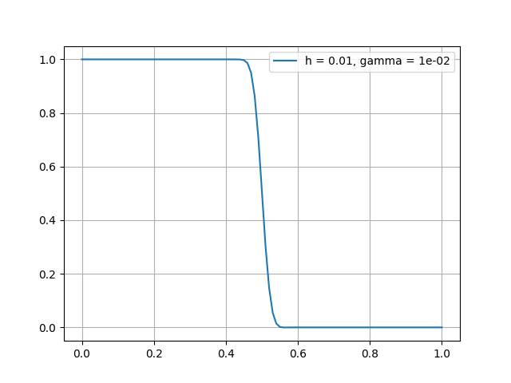

Advection-Diffusion-Reaction with jump (edge) stabilization
=============================================================

This demo code demonstrates how to solve a pure hyperbolic problem with edge stabilization. Here, we solve the transient transport problem with diffusivity set to 0, resulting in a pure advection problem. The full source code can be found in **demo/user_defined/documented/adr_edge_stab/**

Problem definition
--------------------

Strong form

.. math::

	\frac{\partial c}{\partial t} + (1, 0) \cdot \nabla c = 0

The boundary condition is

.. math::

    c(x=0)=1

This result in a simple moving front problem moving in the x direction. The exact solution is simply the Heaviside function

.. math::

   c = H(x-t)

Implementation
-----------------

First we import the necessary libraries

.. code::

    import numpy as np
    import matplotlib.pyplot as plt
    import fenics as fe
    from flatiron_tk.physics import TransientScalarTransport
    from flatiron_tk.mesh import Mesh, RectMesh
    from flatiron_tk.solver import PhysicsSolver

Next, we need to enable the ``shared_facet`` ghost mode in FEniCS. This step is required if you want to run the code in parallel because we will be integrating over interior facets.

.. code::

    fe.parameters["ghost_mode"] = "shared_facet"

Next we set up the domain and the transport problem as usual. Note that this is a pseudo 1D problem where we have a 1D advection occuring in a 2D mesh, therefore we are using the ``RectMesh`` class here.

.. code::

    # Setup mesh and function space
    L = 1
    ne = 100
    h = L/ne
    ymid = L/10/2
    mesh = RectMesh(0, 0, L, L/10, h, fe.MPI.comm_world, 'crossed')

    # Advection speed beta and diffusivity epsilon
    dt = 0.1*h
    # dt = 1e-3
    theta = 0.5
    beta = fe.Constant((1, 0))

    # Define problem
    st = TransientScalarTransport(mesh, dt, theta=theta, tag='c')
    st.set_element('CG', 1)
    st.build_function_space()

    # Diffusivity (here set as a constant)
    D = st.set_diffusivity(0, 0)

    # For the velocity term, we have a time-dependent velocity.
    # We will create two separate functions u0  and un and update
    # them with the appropriate t.
    st.set_advection_velocity(beta, beta)

    # Similarly, we create f0 and fn for the reaction term (here set to zero)
    st.set_reaction(0, 0)

    # Set weak form
    st.set_weak_form()

Now we add the usual SUPG stabilization, but here we add the edge stabilization term using ``add_edge_stab`` with a prescribe stabilization strength

.. code::

    # Add SUPG
    st.add_stab()

    # Add edge stabilization. If gamma is zero, simply not add the edge term
    gamma = 1e-2
    st.add_edge_stab(gamma)

Finally, we solve and write out the solution

.. code::

    # Set bc
    bc_dict = {1:{'type': 'dirichlet', 'value': fe.Constant(1.)}}
    st.set_bcs(bc_dict)

    # Set problem
    solver = PhysicsSolver(st)

    # Set writer
    st.set_writer("output", "h5")

    # Begin transient simulation
    nt = int(0.5/dt)+1
    for i in range(nt):

        # Solve
        solver.solve()

        # Update previous solution
        st.update_previous_solution()

    st.write(time_stamp=0.5)

Full code
------------

The full code is as follows: Please not the slight modification to put the code in a function form. This is done to make it easy to change around parameters. Try changing up the grid size ``ne`` and stabilization strength ``gamma`` to see the effect of edge stabilization.

.. code::

    import numpy as np
    import matplotlib.pyplot as plt
    import fenics as fe
    from flatiron_tk.physics import TransientScalarTransport
    from flatiron_tk.mesh import Mesh, RectMesh
    from flatiron_tk.solver import PhysicsSolver

    fe.parameters["ghost_mode"] = "shared_facet"

    def solve_pure_advection(ne, gamma, supg_on=True):

        # Setup mesh and function space
        L = 1
        h = L/ne
        ymid = L/10/2
        mesh = RectMesh(0, 0, L, L/10, h, fe.MPI.comm_world, 'crossed')

        # Advection speed beta and diffusivity epsilon
        dt = 0.1*h
        # dt = 1e-3
        theta = 0.5
        beta = fe.Constant((1, 0))

        # Define problem
        st = TransientScalarTransport(mesh, dt, theta=theta, tag='c')
        st.set_element('CG', 1)
        st.build_function_space()

        # Diffusivity (here set as a constant)
        D = st.set_diffusivity(0, 0)

        # For the velocity term, we have a time-dependent velocity.
        # We will create two separate functions u0  and un and update
        # them with the appropriate t.
        st.set_advection_velocity(beta, beta)

        # Similarly, we create f0 and fn for the reaction term (here set to zero)
        st.set_reaction(0, 0)

        # Set weak form
        st.set_weak_form()

        # Add SUPG
        if supg_on:
            st.add_stab()

        # Add edge stabilization. If gamma is zero, simply not add the edge term
        if abs(gamma) > 1e-12:
            st.add_edge_stab(gamma)

        # Set bc
        bc_dict = {1:{'type': 'dirichlet', 'value': fe.Constant(1.)}}
        st.set_bcs(bc_dict)

        # Set problem
        solver = PhysicsSolver(st)

        # Set writer
        if supg_on:
            st.set_writer('output_%d_%.5f_supg'%(ne, gamma), 'h5')
        else:
            st.set_writer('output_%d_%.5f'%(ne, gamma), 'h5')

        # Begin transient simulation
        nt = int(0.5/dt)+1
        for i in range(nt):

            # Solve
            solver.solve()

            # Update previous solution
            st.update_previous_solution()

            if fe.MPI.comm_world.rank == 0:
                if supg_on:
                    dset ='output_%d_%.5f' %(ne, gamma)
                else:
                    dset ='output_%d_%.5f_supg' %(ne, gamma)
                print(f"dataset {dset}: time step {i}/{nt} complete.")

        st.write(time_stamp=0.5)

        # Interpolate result at midpoint
        c = st.solution_function()
        cmid = []
        for i in range(len(x)):
            cmid.append(c(fe.Point(x[i], ymid)))
        return np.array(cmid)

    ne = 100
    gamma = 1e-2
    x = np.linspace(0, 1, ne+1)
    cmid = solve_pure_advection(ne, gamma)
    plt.plot(x, cmid, label='h = %.2f, gamma = %.0e'%(1/ne, gamma))
    plt.grid(True)
    plt.legend()
    plt.savefig('hyperbolic.png')
    plt.xlim([0.4, 0.6])
    plt.show()

The code should give the following result

