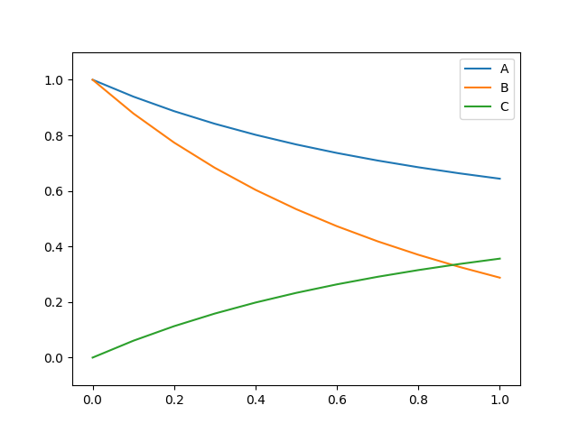

Coupled diffusion-reaction problem with surface reaction
==============================================================

This demo code demonstrate how to solve a steady coupled Diffusion-Reaction problem with surface reaction terms at the boundary. This demo is used to demonstrate how to use the flatiron_tk MultiPhysics module. The source code can be found in **demo/user_defined/documented/steady_coupled_adr/coupled_diffusion_reaction.py**

Problem definition
--------------------

First we define the concentration of chemical species :math:`A`, :math:`B`, and :math:`C`, for a 1D domain of length :math:`L`, we have

.. math::

    D_A \frac{d^2A}{dx^2} - k_v A B = 0

.. math::

    D_B \frac{d^2B}{dx^2} - 2k_v A B = 0

.. math::

    D_C \frac{d^2C}{dx^2} + k_v A B = 0

The left boundary conditions are as follows

.. math::

    A(x=0) = C_0 \\
    B(x=0) = C_0 \\
    C(x=0) = 0 \\

And the surface reactions on the right boundary

.. math::

    \frac{dA}{dx}(x=L) = - \frac{k_s}{D_A} A B \\
    \frac{dB}{dx}(x=L) = - \frac{2k_s}{D_B} A B \\
    \frac{dC}{dx}(x=L) = \frac{k_s}{D_C} A B \\

Implementation
----------------

Fist, we import code the relevant modules from flatiron_tk and the basic libraries and define the mesh and constants

.. code:: python

    import fenics as fe
    from flatiron_tk.physics import MultiPhysicsProblem, ScalarTransport
    from flatiron_tk.mesh import Mesh
    from flatiron_tk.solver import PhysicsSolver

    # Define mesh
    ne = 10
    h = 1/ne
    mesh = LineMesh(0, 1, h)

    # Define constants
    # diffusion coefficients
    D_A = 1.0
    D_B = 1.0
    D_C = 1.0
    k_v = 1 # Volumetric reaction rate
    k_s = 1 # Surface reaction rate
    C0 = 1 # Left BC for species A and B
    u = 0 # No advection

Next I define the ``ScalarTransport`` problems for all three species and set the appopriate tag to disambiguate them.

.. code:: python

    # Define the problem for species A
    A_pde = ScalarTransport(mesh, tag='A')
    A_pde.set_element('CG', 1)
    A_pde.set_advection_velocity(u)
    A_pde.set_diffusivity(D_A)

    # Define the problem for species B
    B_pde = ScalarTransport(mesh, tag='B')
    B_pde.set_element('CG', 1)
    B_pde.set_advection_velocity(u)
    B_pde.set_diffusivity(D_B)

    # Define the problem for species C
    C_pde = ScalarTransport(mesh, tag='C')
    C_pde.set_element('CG', 1)
    C_pde.set_advection_velocity(u)
    C_pde.set_diffusivity(D_C)

Now we build a ``MultiPhysicsProblem`` as a collection of the three ``ScalarTransport`` physics that we created.

.. code:: python

    # Define a multiphysics problem as a combination of physics of
    # species A, B, C
    coupled_physics = MultiPhysicsProblem(A_pde, B_pde, C_pde)
    coupled_physics.set_element()
    coupled_physics.build_function_space()

Now, we will set the terms which couple the three equations together. This is done by first grabbing the solution function of from each species through the ``solution_function()`` method by supplying the appopriate tag for each species. Then we set reaction associated with each species' equation through the ``set_reaction()`` function on the individual ``ScalarTransport`` object. Finally, we finalize the volumetric weak formulation.

.. code:: python

    # Set the coupling part of the equations
    A = coupled_physics.solution_function('A')
    B = coupled_physics.solution_function('B')
    C = coupled_physics.solution_function('C')
    A_pde.set_reaction(-k_v*A*B)
    B_pde.set_reaction(-2*k_v*A*B)
    C_pde.set_reaction(k_v*A*B)

    # Set weakform
    coupled_physics.set_weak_form()

Now we set the boundary conditions dictionary for each physics and create an overall dictionary with the species tag called ``bc_dict`` which we supply into the ``coupled_physics`` object. The format for the individual boundary condition dictionary has the same format as a single species transport problem. Here, we utilize the solution functions that we grabbed earlier to define the Neumann boundary condition. We can do this because Neumann boundary condition is simply an additional term in the weak formulation.

.. code:: python

    # Set BCs for specific physics
    A_bcs = {
            1: {'type': 'dirichlet', 'value': fe.Constant(C0)},
            2: {'type': 'neumann', 'value': -k_s*A*B/D_A}
            }

    B_bcs = {
            1: {'type': 'dirichlet', 'value': fe.Constant(C0)},
            2: {'type': 'neumann', 'value': -2*k_s*A*B/D_B}
            }

    C_bcs = {
            1: {'type': 'dirichlet', 'value': fe.Constant(0)},
            2: {'type': 'neumann', 'value': k_s*A*B/D_C}
            }

    bc_dict = {
            'A': A_bcs,
            'B': B_bcs,
            'C': C_bcs
              }
    coupled_physics.set_bcs(bc_dict)

Finally we solve the problem and plot the results. 

.. code:: python

    # Solve this problem using a nonlinear solver
    solver = PhysicsSolver(coupled_physics)
    solver.solve()

    # Write solution
    coupled_physics.set_writer("output", "pvd")
    coupled_physics.write()

    # Plot solution
    solutions = coupled_physics.solution_function().split(deepcopy=True)
    fe.plot(solutions[0], label='A')
    fe.plot(solutions[1], label='B')
    fe.plot(solutions[2], label='C')
    plt.ylim([-0.1, 1.1])
    plt.legend()
    plt.savefig('coupled_diffusion_reaction.png')

This code should give the following result

