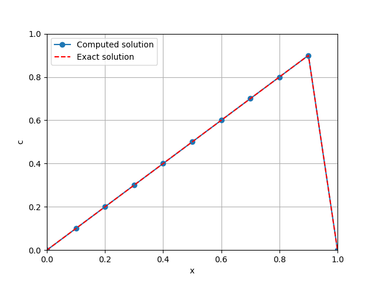

Steady Advection-Diffusion-Reaction problem
===================================================

This demo code demonstrates how to solve a steady Advection-Diffusion-Reaction problem. The full source code can be found in **demo/user_defined/documented/steady_adr/demo_steady_adr.py**

Demo for the 1D advection-diffusion-reaction equation over the domain [0,1].
This problem recreates Fig. 2.1 in `Donea's <https://onlinelibrary.wiley.com/doi/book/10.1002/0470013826>`_.

Problem definition
--------------------

Strong form

.. math::

    u\frac{\partial c}{\partial x} - D\frac{\partial^2 c}{\partial x^2} = R \\

Where the reaction being a constant function:

.. math::

    R=1 \\

The boundary conditions are:

.. math::

    c(0)=0 \;,\; c(1)=0 \\

The analytical solution of this problem is:

.. math::

    c = \frac{1}{u} \left( x - \frac{1-e^{ux/D}}{1-e^{u/D}} \right) \\

Implementation
-----------------

Fist, we import code the relevant modules from FLATiron. Here, we will use the `LineMesh` object which is part of the :doc:`mesh <mesh>` module.

.. code-block:: python

    # Define mesh
    h = 0.1
    mesh = LineMesh(0, 1, h)

Next, we define the relevant physics. In this case, it is the ``ScalarTransport`` physics. Then I set the finite element
to ``Continuous Galerkin of degree 1``. Finally, I set the function space of the problem based on the finite element

.. code-block:: python

    # Define problem
    st = ScalarTransport(mesh)
    st.set_element('CG', 1)
    st.set_function_space()

Next we set the weak formulation of the ADR equations. We do this by setting the advection/diffusion/reaction terms
and finally calling ``set_weak_form()`` to complete setting the basic weak formulation.

For a higher Peclet number problem, Galerkin finite element formulation is known to be unstable. Here, we provide SUPG stabilizationused for high Peclet number problems. Simply call ``add_stab()`` to add the stabilization to the weak formulation. The input ``su`` refer to the type of SUPG stabilization constant. See :doc:`Scalar transport physics <scalar_transport_problem>` for different choices of stabilization constants.

.. code-block:: python

    # Set constants
    u = 1
    Pe = 5
    D = u/Pe/2*h
    R = 1.
    st.set_advection_velocity(u)
    st.set_diffusion_coefficient(D)
    st.set_reaction(R)

    # Set weak form
    st.set_weak_form()

    # Add supg term
    st.add_stab('su')

Next, we define the boundary conditions. We take in a dictionary with the key being the boundary id, and the value
being a dictionary indicating the type and value of the boundary conditions. The types can be either ``dirichlet`` or ``neumann``. This problem has :math:`c=0` on both sides.

.. code-block:: python

    # Set bc
    bc_dict = {1:{'type': 'dirichlet', 'value': fe.Constant(0.)},
               2:{'type': 'dirichlet', 'value': fe.Constant(0.)}}
    st.set_bcs(bc_dict)

Next, we set up the physics solver and solve the problem. We opt to write the solution in a HDF5 format within the ``output/`` directory.

.. code-block:: python

    # Set solver
    solver = PhysicsSolver(st)

    # Solve
    solver.solve()
    st.set_writer('output', 'h5')
    st.write()

For simple post-processing, we compare the computed solution with the exact solution by plotting the results with matplotlib. The computed solution can be accessed using ``solution_function()`` method.

.. code-block:: python

    # Plot solution
    x = np.linspace(0, 1, int(1/h)+1)
    g = u/D
    sol_exact = 1/u * (x - (1-np.exp(g*x))/(1-np.exp(g)))
    import fenics as fe
    # Here we will plot with FEniCS
    fe.plot(st.solution_function(), linestyle='-', marker='o', label='Computed solution')
    plt.plot(x, sol_exact, 'r--', label='Exact solution')
    plt.grid(True)
    plt.ylim([0,1])
    plt.xlim([0,1])
    plt.xlabel('x')
    plt.ylabel('c')
    plt.legend()
    plt.savefig('demo_steady_adr.png')

The code should give the following result

