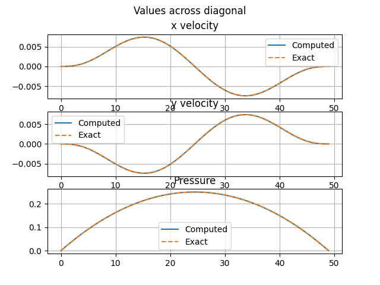

Stokes flow with external forcing
========================================

This demo shows how to solve a stokes flow within a 1-by-1 rectangular channel with external forcing. This problem is defined in Chapter 6.8 in `Donea's <https://onlinelibrary.wiley.com/doi/book/10.1002/0470013826>`_.

Problem definition
---------------------

.. math::

	\nu \nabla^2 \textbf{u} - \nabla p = \textbf{b}

	\nabla \cdot \textbf{u} = 0

With the forcing term :math:`\textbf{b} = (b_1, b_2)` are defined as

.. math::

   b_1 = &( 12 - 24y)  x^4 + (-24 + 48y)x^3 + ( 12 - 48y + 72y^2 - 48y^3 )x^2 + \\
   &( -2 + 24y - 72y^2 + 48y^3 )x + (  1 -  4y + 12y^2 -  8y^3 ) \\
   \\
   b_2 = &(  8 - 48y + 48y^2 )x^3 + (-12 + 72y - 72y^2 )x^2 + \\
   &( 4 - 24y + 48y^2 - 48y^3 + 24y^4 )x + (- 12y^2 + 24y^3 - 12y^4 )\\

and the boundary conditions being :math:`u=0` on all four faces and :math:`p=0` at the bottom left corner.

The analytical solution is

.. math::

   u_1(x,y) &= x^2(1-x)^2(2y-6y^2+4y^3) \\
   \\
   u_2(x,y) &= -y^2(1-y)^2(2x-6x^2+4x^3) \\
   \\
   p(x,y) &= x(1-x)\\

Implementation
---------------------

First we import the relevant modules and build the mesh and ``StokesFlow`` object. In the ``set_element()`` method, we supply the finite element type and polynomial order for ``u`` and ``p`` respectively. Here, we will use the Q2P1 or so called Taylor-Hood element.

.. code-block:: python

    # Define mesh
    ne = 64
    h = 1/ne
    mesh = RectMesh(0, 0, 1, 1, h)

    # Define problem
    ics = StokesFlow(mesh)
    ics.set_element('CG', 2, 'CG', 1)
    ics.build_function_space()

Next se set the external body force and the kinematic viscosity. Notice that the cartesian coordinates :math:`(x,y,z)` are called ``x[0]``, ``x[1]``, and ``x[2]`` respectively. In the case where we use an unstable combination of elements, e.g., Q1P1, we can use the ``add_stab()`` function for pressure stabilization commented within the sample code

.. code-block:: python

    # Set coefficients on each term
    # here since we are in transient mode, we have to set
    # the function defining the previous and current time step.
    # Since D and u are constants, we repeat the values for both entry
    bx4 = "( 12 - 24*x[1]) * pow(x[0], 4)"
    bx3 = "(-24 + 48*x[1]) * pow(x[0], 3)"
    bx2 = "( 12 - 48*x[1] + 72*pow(x[1], 2) - 48*pow(x[1], 3) ) * pow(x[0], 2)"
    bx1 = "( -2 + 24*x[1] - 72*pow(x[1], 2) + 48*pow(x[1], 3) ) * x[0]"
    bx0 = "(  1 -  4*x[1] + 12*pow(x[1], 2) -  8*pow(x[1], 3) )"

    by3 = "(  8 - 48*x[1] + 48*pow(x[1], 2) ) * pow(x[0], 3)"
    by2 = "(-12 + 72*x[1] - 72*pow(x[1], 2) ) * pow(x[0], 2)"
    by1 = "(  4 - 24*x[1] + 48*pow(x[1], 2) - 48*pow(x[1], 3) + 24*pow(x[1], 4) ) * x[0]"
    by0 = "(              - 12*pow(x[1], 2) + 24*pow(x[1], 3) - 12*pow(x[1], 4) )"

    bx = "%s + %s + %s + %s + %s" % (bx4, bx3, bx2, bx1, bx0)
    by = "%s + %s + %s + %s" % (by3, by2, by1, by0)
    b = fe.Expression((bx, by), degree=4)
    ics.set_body_force(b)
    nu = 1.
    ics.set_kinematic_viscosity(nu)

    # Set weak form
    ics.set_weak_form()

    # Set stabilization
    # ics.add_stab()

Next, we de fine the boundary conditions. Fundamentally, Stokes flow is a ``MultiphysicsProblem`` class as it contains multiple variables and multiple equations. We will set the boundary conditions as a nested dictionary. There are a few things of note

1. The default name for the velocity and pressure variable are ``u`` and ``p`` respectively. Please make sure that the final nested dictionary has the appopriate variable name.
2. We use the ``'zero'`` string as the value for the boundary condition. This is a shorthand for both a zero scalar and a zero vector.
3. For the pressure boundary condition, we set a point-wise boundary condition instead of a pressure boundary. This is signified by the ``'point_#'`` key instead of the boundary id. Here, ``#`` is substituted with an integer id of the condition. This type of Dirichlet boundary condition requires the an additional key ``x`` which is the point location. This point location must be the *exact* point within the mesh domain.

.. code-block:: python

    # Set bc
    u_bcs = {
            1: {'type': 'dirichlet', 'value': 'zero'},
            2: {'type': 'dirichlet', 'value': 'zero'},
            3: {'type': 'dirichlet', 'value': 'zero'},
            4: {'type': 'dirichlet', 'value': 'zero'}
            }
    p_bcs = {'point_0': {'type': 'dirichlet', 'value':'zero', 'x': (0., 0.)}}
    bc_dict = {'u': u_bcs,
               'p': p_bcs}
    ics.set_bcs(bc_dict)

Finally we set the problem and solve

.. code-block:: python

    # Setup io
    ics.set_writer('output', 'h5')

    # Set problem
    solver = PhysicsSolver(ics)

    # Solve
    solver.solve()

Finally we write the exact solution and plot a comparison. 

.. code-block:: python

    u0e = " pow(x[0], 2)*pow(1-x[0], 2)*(2*x[1] - 6*pow(x[1], 2) + 4*pow(x[1], 3))"
    u1e = "-pow(x[1], 2)*pow(1-x[1], 2)*(2*x[0] - 6*pow(x[0], 2) + 4*pow(x[0], 3))"
    u_exact = fe.Expression( (u0e, u1e), degree=2 )
    u_exact = fe.interpolate(u_exact, ics.V.sub(0).collapse())
    p_exact = fe.Expression("x[1]*(1-x[1])", degree=2)
    p_exact = fe.interpolate(p_exact, ics.V.sub(1).collapse())
    fe.File("output/ue.pvd") << u_exact
    ics.write()

    # Plot solution against exact solution
    n_sample = 50
    span = np.linspace(0, 1, n_sample)

    u_exact_vals = []
    u_comp_vals = []
    p_exact_vals = []
    p_comp_vals = []
    for xi, yi in zip(span, span):
        u, p = ics.solution_function().split(deepcopy=True)

        u_exact_vals.append(u_exact(fe.Point(xi, yi)))
        u_comp_vals.append(u(fe.Point(xi, yi)))

        p_exact_vals.append(p_exact(fe.Point(xi, yi)))
        p_comp_vals.append(p(fe.Point(xi, yi)))

    fig, ax = plt.subplots(nrows = 3)
    u_exact_vals = np.array(u_exact_vals)
    u_comp_vals = np.array(u_comp_vals)
    p_exact_vals = np.array(p_exact_vals)
    p_comp_vals = np.array(p_comp_vals)

    fig.suptitle('Values across diagonal')
    ax[0].plot(u_comp_vals[:,0], label='Computed')
    ax[0].plot(u_exact_vals[:,0], '--', label='Exact')
    ax[0].set_title('x velocity')
    ax[0].grid(True)
    ax[0].legend()

    ax[1].plot(u_comp_vals[:,1], label='Computed')
    ax[1].plot(u_exact_vals[:,1], '--', label='Exact')
    ax[1].set_title('y velocity')
    ax[1].grid(True)
    ax[1].legend()

    ax[2].plot(p_comp_vals, label='Computed')
    ax[2].plot(p_exact_vals, '--', label='Exact')
    ax[2].set_title('Pressure')
    ax[2].grid(True)
    ax[2].legend()

    plt.show()

This code should produce the following result

