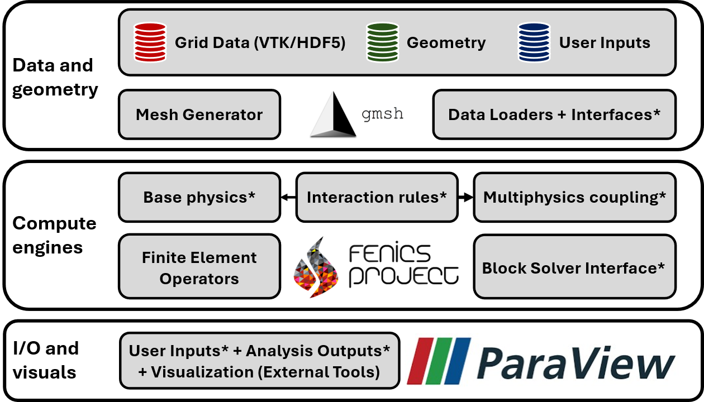

# Summary 
FLATiron toolkit is an extension to the Finite Element Method (FEM) package, DOLFINx [@barattaDOLFINxNextGeneration2023; @scroggsConstructionArbitraryOrder2022; @scroggsBasixRuntimeFinite2022], which is installed using the package installer for Python, `pip`, after downloading the source files from GitHub. FLATiron is a hierarchical, modular, transport physics package that streamlines the construction of coupled transport physics problems using residual-based stabilized FE methods. Our toolkit is designed to enable researchers to develop computational transport workflows without requiring familiarity with the Finite Element Method or programming expertise. At the same time, it exposes the FEM interactions within the modular source code. This design enables customization and expansion of physics modules to capture a variety of research applications.

# Statement of Need
Computational flow and transport simulations have become critical in many applications, highlighting the need for computing tools accessible to researchers without computational expertise. Commercially available high-level tools like Ansys Fluent are powerful and easy to use; however, they often lack flexibility and do not support multiphysics coupling or customized problem definitions, both of which are essential in many applications. Conversely, low-level tools (e.g., FEniCS) offer greater flexibility at the cost of increased complexity. While many mid-level abstractions exist (e.g., IBAMR, MOOSE, Lethe, deal.ii [@noauthor_ibamribamr_2026; @harbour_40_2025; @blais_lethe_2020; @arndt_dealii_2021]), "program-heavy" syntax is a **barrier to adoption**, requiring significant experience and time buy-in from users. The limitations of domain-specific tools further complicate this challenge. Domain-specific tools are excellent in their niche fields but rigid when used outside their intended use cases. These specialized tools reduce inter-domain communication, preventing cutting-edge models from reaching across domain boundaries and leaving the full potential of simulation technologies unrealized. The state of the art requires a computational platform that enables straightforward custom multiphysics coupling for mid-level experts. 

To address this need, we designed the FLATiron toolkit, a **hierarchical and modular** framework for flow and transport problems. FLATiron is an abstraction of FEniCS-DOLFINx, a powerful library that enables users to symbolically build customized computational frameworks for numerically solving systems of partial differential equations (PDEs). FLATiron utilizes modular physics objects to define the weak forms of governing equations. These forms can be used individually or combined to create coupled multiphysics formulations without manually modifying the weak forms. In addition to modular physics coupling, FLATiron simplifies the configuration of advanced PETSc solvers and field-splitting preconditioners and reduces the complexity of defining and applying boundary conditions through modularization [@dalcin_parallel_2011; @balay_efficient_1997, @balay_petsctao_2025]. These abstractions maintain flexibility while remaining specialized to flow- and transport-problem domains, and seamlessly integrate data generated by other commonly used computational tools, facilitating interoperability with existing workflows and codes.

# Functionality 
FLATiron toolkit is organized into six core modules: FEM, Functions, IO, Mesh, Physics, and Solver. Together, they provide a hierarchical interface for developing multiphysics simulations in DOLFINx. Each module abstracts lower-level DOLFINx functionality, reducing the need to reimplement extensive low-level code and accelerating the development workflow. 

## FEM
The `FEM` module contains utilities for creating boundary conditions and transferring data between non-matching meshes. This module simplifies common finite element setup tasks such as defining Dirichlet conditions on tagged boundaries or interpolating field data between meshes.

## Functions
The `Functions` module provides utilities for creating and evaluating finite element functions used throughout the toolkit. The module includes methods for constructing scalar indicator fields, defining analytical inlet velocity profiles (plug, parabolic, and paraboloid), and evaluating DOLFINx functions at arbitrary points. In addition, this module includes convenience utilities for creating constants and computing flow rates through boundaries.  

## IO
This module provides tools for reading and writing simulation data across several formats. The module supports importing meshes and subdomain markers from GMSH and XDMF (stored in the `Mesh` module), checkpointing field data using ADIOS4DOLFINX, and exporting results for visualization in ParaView through PVD and XDMF writers. The module also includes an input-file parser for managing simulation parameters, used extensively in `Apps`, as well as utilities for writing Lagrangian tracer trajectories. 

## Mesh
FLATiron toolkit's `Mesh` extends the DOLFINx `Mesh` class with automatic boundary and subdomain tagging, geometric utilities, and support for defining line, box, and cuboid geometries. When a mesh file is loaded, the toolkit automatically constructs and stores boundary and subdomain markers. Similar to the `FEM` module, this significantly reduces the code required to mark boundaries and set boundary conditions. The module contains methods for computing boundary areas, centroids, and mean normals. These features ensure consistent handling of domain geometry and boundary information across simulations while maintaining compatibility with standard DOLFINx data structures.

## Physics
Each transport physics is built on the abstract `PhysicsProblem` class, which provides a framework for defining transport physics using the Finite Element method. It includes methods to define the finite element, function space, weak form, boundary conditions, and output results. Specific physics modules inherit from this object and implement weak forms, flux forms, and other methods specific to the governing equations. The `MultiphysicsProblem` class allows multiple instances of `PhysicsProblems` to be monolithically combined. Each subphysics contains a weak form and a set of functions defined on a subspace of the overall problem.  Currently, FLATiron supports scalar transport and reactions (e.g., heat and mass transfer), incompressible Stokes flow, incompressible Navier-Stokes flow (Laminar), and flow through porous media using Darcy-Brinkman penalization terms. In addition to these grid-based Eulerian methods, FLATiron supports Lagrangian particle tracking through the `MasslessTracerTracker` object, which advects discrete particles through the computational domain.

## Solver
The `Solver` module abstracts DOLFINx’s `NonLinearProblem` and `NewtonSolver` classes. `NonLinearProblem` provides the weak form, Jacobian, solution functions, and boundary conditions from `PhysicsProblem` to the underlying solvers. `NonLinearSolver` extends DOLFINx’s NewtonSolver, providing default tolerances, convergence criteria, relaxation parameters, and hooks for customizing the underlying KSP objects. The `BlockSolver` module simplifies preconditioning of multiphysics problems using PETSc's fieldsplit preconditioner. Users define field splits using simple dictionaries and optional KSP setup functions for each block. `BlockNonLinearSolver` extends `NonLinearSolver` to automatically configure the root KSP and child KSPs according to the block tree, making robust preconditioning for coupled systems straightforward and flexible.

## Apps
In addition to a comprehensive set of FLATiron demos, we have provided "application files" that run flow and transport simulations by specifying an input file. These applications allow for users inexperienced with Python and the finite element method to run simple transport problems without modifying any code. 

# Scope and Limitations
The FLATiron toolkit focuses on fluid-transport problems governed by incompressible, Newtonian, and laminar flow. This scope supports a wide range of canonical test cases, but excludes more complex flow regimes such as turbulence, compressible flow, or multiphase systems. The present Lagrangian particle-tracer module tracks only massless particles and does not account for particle inertia or two-way fluid-structure interactions (FSI). These choices simplify implementation and ensure stable solver performance, but limit the framework's ability to model strongly coupled effects. 

Future releases of FLATiron will expand its range of physical models and solver capabilities. Our planned developments include support for non-Newtonian fluids, beginning with simple power-law models; variational multiscale methods for simulating compressible, quasi-turbulent regimes; and, eventually, solid deformation through both linear and hyperelastic formulations for modeling fluid-solid interactions. These planned extensions aim to broaden FLATIron's applicability while maintaining its emphasis on accessibility, modularity, and transparency for the FEniCSx user community. 

# FAIR Principles for Research Software
FLATiron is designed in accordance with the FAIR Guiding Principles for scientific data management and stewardship. The software and associated metadata are easily **findable** on our [GitHub](https://github.com/flowlabcu/FLATiron) and [OSF](https://osf.io/96xpe/overview) pages with documentation readily available through [Read the Docs](https://flatiron-docs.readthedocs.io/en/latest/index.html). The software, documentation, and learning materials (installation and demonstration videos) are retrievable and **accessible** using standard tools. When one module is being updated, metadata and identifiers for other modules remain live. The FLATiron toolkit reads, writes, and exchanges data in standard formats usable by other software (e.g., VTK/HDF5 I/O formats are readable by standard visualization tools). The Python backend **interoperates** with other modern computing libraries (E.g., PyTorch). The hierarchical, modular, and **reusable** API design can be modified, customized, and built upon by users. Documentation, tutorials, and demonstrations are available for users ranging from lay users to experienced developers. The open-source community standard license (GNU LGPL) aids resusabilty at the community level. 

# Performance and Evaluation 
The FLATiron toolkit is MPI-enabled and uses DOLFINx and underlying JIT compilation to build algebraic representations of governing equations, which in turn compose PETSc arrays to solve large-scale matrix problems. We assume that FLATiron inherits scalability properties from DOLFINx and PETSc, which have been extensively tested on large distributed-memory systems. [PETSc documentation](https://petsc.org/release/manual/streams/) includes details on characterising performance using the STREAMS benchmark [@mccalpin_memory_1995]. DOLFINx strong and weak scaling information is available through a DOLFINx performance testing repository on the [FEniCS project GitHub](https://github.com/FEniCS/performance-test). While FLATiron itself has not been systematically evaluated for scaling, it has been successfully used for multiple large-scale case studies on the University of Colorado Research Computing (CURC) Alpine (current) and Summit (retired) clusters. We present a representative selection of these large-scale studies run on Alpine nodes equipped with AMD Milan (x86_64) processors. Complete hardware descriptions are available in the [CURC documentation](https://curc.readthedocs.io/en/latest/clusters/alpine/alpine-hardware.html). 

One study on blood clot mechanics demonstrates the toolkit's ability to model biochemical transport within dynamic porous domains [@teeraratkul_microstructure_2021]. Using the stabilization available in FLATiron and the fictitious domain method, an arbitrarily shaped, transient, and permeable clot domain was modeled as a porous medium within a fluid domain. Fluid simulations were coupled with biochemical transport physics to model the delivery of clot-dissolving pharmacological agents into the clot domain for acute ischemic stroke treatment. A later study used similar physics to model biochemical transport relevant to clot formation in a dynamically changing, shape-varying clot domain [@teeraratkul_investigating_2024]. This _in silico_ model was validated against experimental measurements of biochemical species captured via intravital microscopy. An oestelogy study used the FLATiron toolkit to model intra-bone fluid mechanics [@venkatesh_high-fidelity_2025]. Here, a bone segment was modeled using a synthetic material and digitally reconstructed from micro-CT data. FLATiron was used to capture custom computational endpoints (wall shear stress) within a complex, to-scale, anatomically realistic domain. The _in silico_ model replicated an experimental bioreactor system, including a porous region modeling the bioreactor-scaffold interface.    

## Acknowledgement 
This work utilized the Alpine high performance computing resource at the University of Colorado Boulder. Alpine is jointly funded by the University of Colorado Boulder, the University of Colorado Anschutz, Colorado State University, and the National Science Foundation (award 2201538).

This work utilized the Summit supercomputer, which is supported by the National Science Foundation (awards ACI-1532235 and ACI-1532236), the University of Colorado Boulder, and Colorado State University. The Summit supercomputer is a joint effort of the University of Colorado Boulder and Colorado State University.

Data storage supported by the University of Colorado Boulder ‘PetaLibrary'.

The authors gratefully acknowledge the many valuable discussions and feedback from colleagues and users. In particular, we thank Prof. Jed Brown (Department of Computer Science, University of Colorado Boulder); Prof. Adarsh Krishnamurthy (Department of Mechanical Engineering, Iowa State University); Prof. John Pellegrino and Prof. Maureen Lynch (Department of Mechanical Engineering, University of Colorado Boulder); and Prof. Frederik Denorme (Department of Emergency Medicine, Washington University in St. Louis, and the Faculty of Biomedical, Pharmaceutical and Veterinary Sciences, University of Antwerp). 

